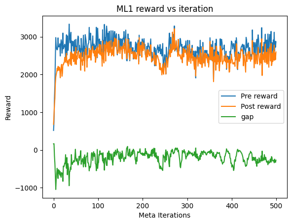
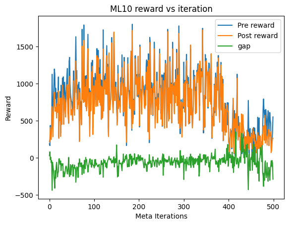

# Meta Learning
This section contains the code for a [MAML](https://arxiv.org/pdf/1703.03400) agent trained on Metaworld's ML1 and ML10 environments.

## MAML

### Algorithm
[MAML](https://arxiv.org/pdf/1703.03400) is a meta learning algorithm with the goal of optimizing the initialization of an agent such that gradient descent in any direction yields good results. This allows an agent to be trained on many different tasks similar in state space and action space to quickly adapt to the new task with very few gradient steps. The underlying RL agent uses [REINFORCE](https://www.geeksforgeeks.org/machine-learning/reinforce-algorithm/).

### ML1
The agent was trained on Reach-v3 using 20 tasks over 500 meta iterations.

#### Training Curve

#### Results
The agent managed to optimize the initialization taking the initial reward from 200~600 to 2700+ consistently. This results was achieved very quickly in the first 100 meta iterations however quickly plateued. Despite the agent learning a good initialization, the reward after taking any gradient steps was consistently worse than the initialization, this could be because standard SGD was used rather than [TRPO](https://spinningup.openai.com/en/latest/algorithms/trpo.html) which the paper used.

### ML10
#### Training Curve

#### Results
The agent was trained on 20 tasks per iteration over 500 iterations. The results were extrmeely noisy with rewards over 1500 and under 500 both consistently appearing. No convergence was observed in this case likely due to the range of environments as opposed to ML1.
